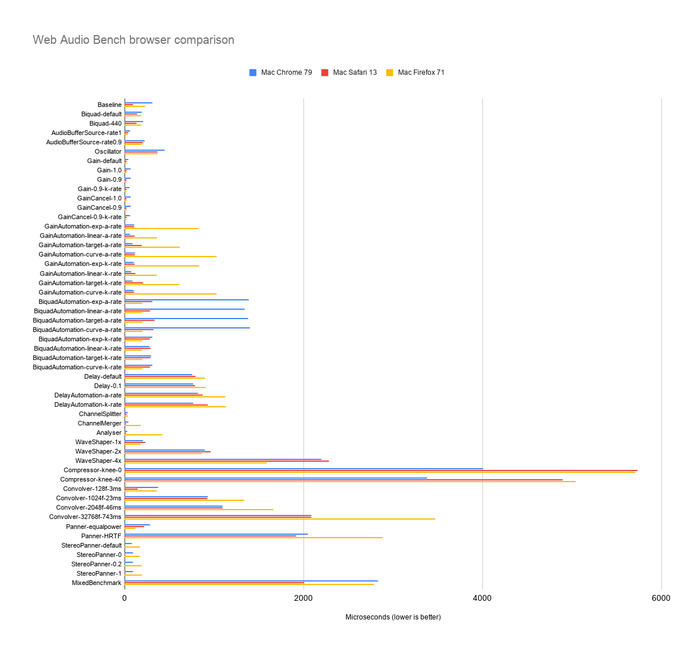
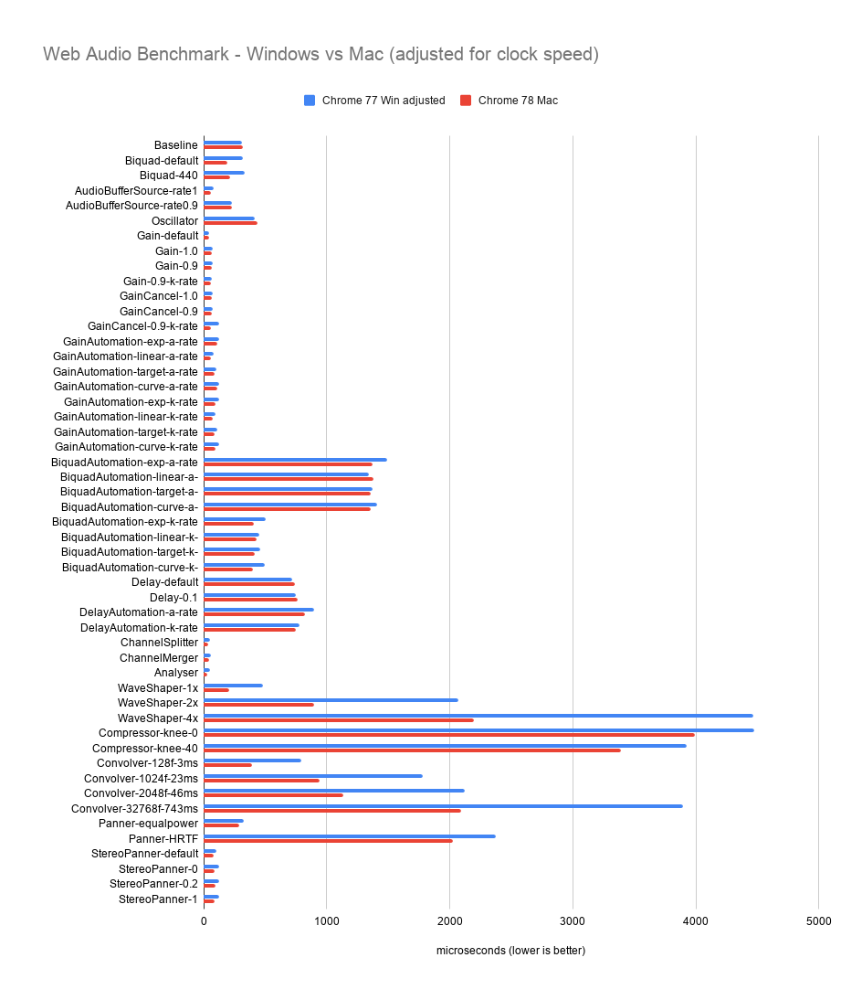
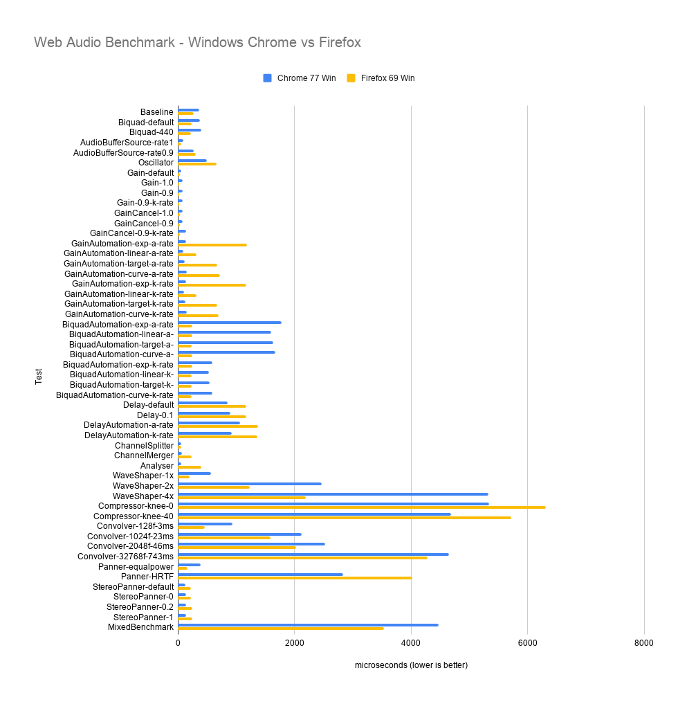
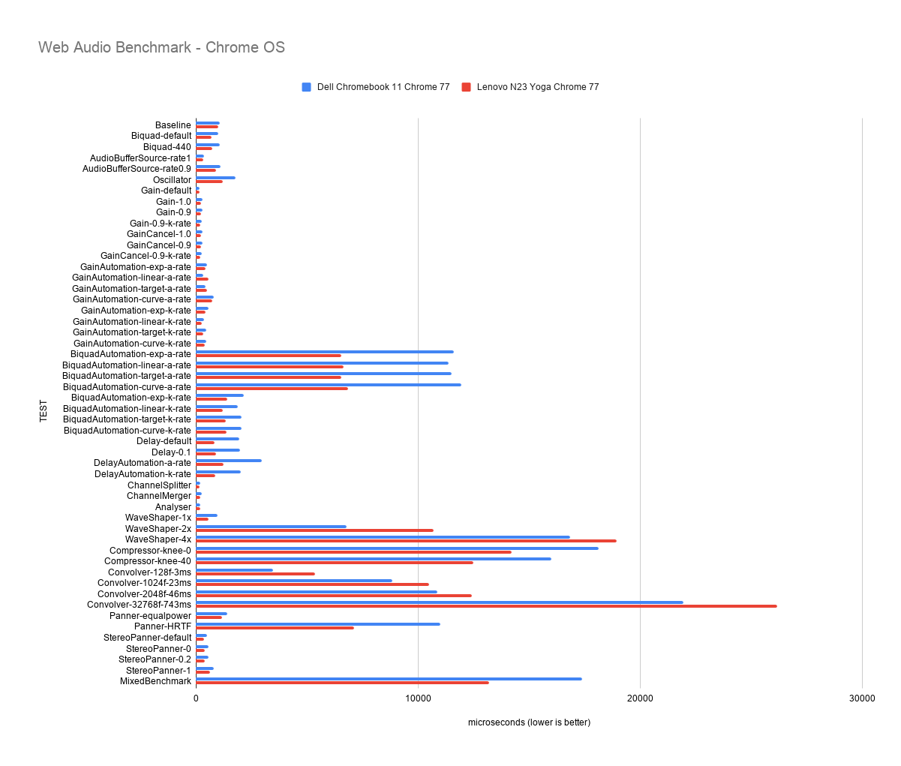

# Web Audio Bench Examples

## Mac

* MacBook Pro 2017 (3,1 GHz Intel Core i7).
* The performance is similar across browsers for AudioBufferSourceNode and OscillatorNode.
* There are big variations in GainNode and BiquadFilterNode automation performance. 
* The most expensive node types are CompressorNode and the nodes involving FFT; WaveShaperNode, ConvolverNode and PannerNode, with variations across browsers.
* Safari has the fastest baseline and most nodes are a bit faster. This could indicate faster framework, such as a more efficient audio graph traversal / audio data propagation.
* The MixedBenchmark metric is a compound score using a handful of the most commonly used nodes. It can be used as an overall score for a given platform and browser.

| TEST                           | Mac Chrome 79 | Mac Safari 13 | Mac Firefox 71 |
|--------------------------------|---------------|---------------|----------------|
| Baseline                       | 313           | 97            | 230            |
| Biquad-default                 | 195           | 139           | 185            |
| Biquad-440                     | 204           | 134           | 184            |
| AudioBufferSource-rate1        | 62            | 45            | 35             |
| AudioBufferSource-rate0.9      | 229           | 204           | 193            |
| Oscillator                     | 448           | 370           | 372            |
| Gain-default                   | 42            | 21            | 21             |
| Gain-1.0                       | 66            | 20            | 22             |
| Gain-0.9                       | 66            | 24            | 23             |
| Gain-0.9-k-rate                | 59            | 22            | 21             |
| GainCancel-1.0                 | 66            | 21            | 22             |
| GainCancel-0.9                 | 66            | 23            | 22             |
| GainCancel-0.9-k-rate          | 60            | 22            | 21             |
| GainAutomation-exp-a-rate      | 108           | 111           | 830            |
| GainAutomation-linear-a-rate   | 63            | 113           | 362            |
| GainAutomation-target-a-rate   | 90            | 196           | 615            |
| GainAutomation-curve-a-rate    | 114           | 114           | 1029           |
| GainAutomation-exp-k-rate      | 99            | 117           | 834            |
| GainAutomation-linear-k-rate   | 76            | 122           | 363            |
| GainAutomation-target-k-rate   | 90            | 206           | 612            |
| GainAutomation-curve-k-rate    | 99            | 109           | 1029           |
| BiquadAutomation-exp-a-rate    | 1387          | 308           | 201            |
| BiquadAutomation-linear-a-rate | 1347          | 283           | 193            |
| BiquadAutomation-target-a-rate | 1382          | 340           | 201            |
| BiquadAutomation-curve-a-rate  | 1403          | 327           | 199            |
| BiquadAutomation-exp-k-rate    | 309           | 287           | 200            |
| BiquadAutomation-linear-k-rate | 276           | 290           | 196            |
| BiquadAutomation-target-k-rate | 296           | 292           | 199            |
| BiquadAutomation-curve-k-rate  | 313           | 286           | 198            |
| Delay-default                  | 753           | 795           | 902            |
| Delay-0.1                      | 767           | 790           | 908            |
| DelayAutomation-a-rate         | 818           | 875           | 1128           |
| DelayAutomation-k-rate         | 768           | 930           | 1133           |
| ChannelSplitter                | 38            | 21            | 36             |
| ChannelMerger                  | 44            | 19            | 182            |
| Analyser                       | 33            | 17            | 420            |
| WaveShaper-1x                  | 209           | 234           | 177            |
| WaveShaper-2x                  | 902           | 962           | 865            |
| WaveShaper-4x                  | 2203          | 2283          | 1590           |
| Compressor-knee-0              | 4013          | 5737          | 5710           |
| Compressor-knee-40             | 3383          | 4903          | 5047           |
| Convolver-128f-3ms             | 379           | 150           | 360            |
| Convolver-1024f-23ms           | 933           | 923           | 1340           |
| Convolver-2048f-46ms           | 1097          | 1093          | 1667           |
| Convolver-32768f-743ms         | 2088          | 2090          | 3478           |
| Panner-equalpower              | 285           | 221           | 122            |
| Panner-HRTF                    | 2047          | 1920          | 2887           |
| StereoPanner-default           | 80            | -             | 176            |
| StereoPanner-0                 | 92            | -             | 174            |
| StereoPanner-0.2               | 93            | -             | 194            |
| StereoPanner-1                 | 94            | -             | 192            |
| MixedBenchmark                 | 2835          | 2010          | 2791           |

## Windows vs Mac Chrome

* Mac: MacBook Pro 2017 (3,1 GHz Intel Core i7).
* Windows: Intel Core i5-7300U 2.6Hgz 2.71 GHz. Test results were adjusted for clock speed difference (2.6 / 3.1). 
* Windows has 100% slower FFT performance.
* Windows has 50% slower Biquad performance.

| Test                           | Chrome 77 Win adjusted | Chrome 78 Mac |
|--------------------------------|------------------------|---------------|
| Baseline                       | 313                    | 317           |
| Biquad-default                 | 321                    | 190           |
| Biquad-440                     | 335                    | 211           |
| AudioBufferSource-rate1        | 78                     | 61            |
| AudioBufferSource-rate0.9      | 231                    | 229           |
| Oscillator                     | 414                    | 437           |
| Gain-default                   | 45                     | 42            |
| Gain-1.0                       | 72                     | 65            |
| Gain-0.9                       | 70                     | 69            |
| Gain-0.9-k-rate                | 66                     | 59            |
| GainCancel-1.0                 | 74                     | 66            |
| GainCancel-0.9                 | 71                     | 69            |
| GainCancel-0.9-k-rate          | 122                    | 60            |
| GainAutomation-exp-a-rate      | 122                    | 107           |
| GainAutomation-linear-a-rate   | 84                     | 60            |
| GainAutomation-target-a-rate   | 100                    | 89            |
| GainAutomation-curve-a-rate    | 127                    | 109           |
| GainAutomation-exp-k-rate      | 122                    | 98            |
| GainAutomation-linear-k-rate   | 94                     | 73            |
| GainAutomation-target-k-rate   | 108                    | 89            |
| GainAutomation-curve-k-rate    | 126                    | 98            |
| BiquadAutomation-exp-a-rate    | 1494                   | 1372          |
| BiquadAutomation-linear-a-rate | 1344                   | 1380          |
| BiquadAutomation-target-a-rate | 1375                   | 1354          |
| BiquadAutomation-curve-a-rate  | 1406                   | 1361          |
| BiquadAutomation-exp-k-rate    | 502                    | 410           |
| BiquadAutomation-linear-k-rate | 453                    | 432           |
| BiquadAutomation-target-k-rate | 460                    | 414           |
| BiquadAutomation-curve-k-rate  | 493                    | 401           |
| Delay-default                  | 720                    | 738           |
| Delay-0.1                      | 752                    | 763           |
| DelayAutomation-a-rate         | 899                    | 820           |
| DelayAutomation-k-rate         | 776                    | 750           |
| ChannelSplitter                | 51                     | 37            |
| ChannelMerger                  | 60                     | 43            |
| Analyser                       | 51                     | 32            |
| WaveShaper-1x                  | 481                    | 208           |
| WaveShaper-2x                  | 2073                   | 897           |
| WaveShaper-4x                  | 4470                   | 2193          |
| Compressor-knee-0              | 4476                   | 3993          |
| Compressor-knee-40             | 3928                   | 3393          |
| Convolver-128f-3ms             | 790                    | 392           |
| Convolver-1024f-23ms           | 1781                   | 943           |
| Convolver-2048f-46ms           | 2119                   | 1137          |
| Convolver-32768f-743ms         | 3897                   | 2089          |
| Panner-equalpower              | 325                    | 285           |
| Panner-HRTF                    | 2376                   | 2027          |
| StereoPanner-default           | 105                    | 79            |
| StereoPanner-0                 | 124                    | 91            |
| StereoPanner-0.2               | 124                    | 94            |
| StereoPanner-1                 | 124                    | 91            |
| MixedBenchmark                 | 3752                   | 2542          |

## Windows

* Windows: Intel Core i5-7300U 2.6Hgz 2.71 GHz.
* A lot of differences due to completely different implementations.

| Test                           | Chrome 77 Win | Firefox 69 Win |
|--------------------------------|---------------|----------------|
| Baseline                       | 373           | 273            |
| Biquad-default                 | 383           | 237            |
| Biquad-440                     | 400           | 227            |
| AudioBufferSource-rate1        | 93            | 54             |
| AudioBufferSource-rate0.9      | 276           | 307            |
| Oscillator                     | 494           | 660            |
| Gain-default                   | 54            | 35             |
| Gain-1.0                       | 86            | 29             |
| Gain-0.9                       | 84            | 29             |
| Gain-0.9-k-rate                | 79            | 29             |
| GainCancel-1.0                 | 88            | 32             |
| GainCancel-0.9                 | 85            | 31             |
| GainCancel-0.9-k-rate          | 145           | 30             |
| GainAutomation-exp-a-rate      | 146           | 1183           |
| GainAutomation-linear-a-rate   | 100           | 321            |
| GainAutomation-target-a-rate   | 119           | 675            |
| GainAutomation-curve-a-rate    | 151           | 725            |
| GainAutomation-exp-k-rate      | 146           | 1177           |
| GainAutomation-linear-k-rate   | 112           | 316            |
| GainAutomation-target-k-rate   | 129           | 680            |
| GainAutomation-curve-k-rate    | 150           | 698            |
| BiquadAutomation-exp-a-rate    | 1781          | 247            |
| BiquadAutomation-linear-a-rate | 1602          | 249            |
| BiquadAutomation-target-a-rate | 1639          | 243            |
| BiquadAutomation-curve-a-rate  | 1676          | 253            |
| BiquadAutomation-exp-k-rate    | 598           | 246            |
| BiquadAutomation-linear-k-rate | 540           | 234            |
| BiquadAutomation-target-k-rate | 549           | 239            |
| BiquadAutomation-curve-k-rate  | 588           | 239            |
| Delay-default                  | 858           | 1170           |
| Delay-0.1                      | 897           | 1173           |
| DelayAutomation-a-rate         | 1072          | 1382           |
| DelayAutomation-k-rate         | 925           | 1370           |
| ChannelSplitter                | 61            | 62             |
| ChannelMerger                  | 72            | 243            |
| Analyser                       | 61            | 398            |
| WaveShaper-1x                  | 573           | 203            |
| WaveShaper-2x                  | 2472          | 1232           |
| WaveShaper-4x                  | 5330          | 2197           |
| Compressor-knee-0              | 5337          | 6317           |
| Compressor-knee-40             | 4683          | 5720           |
| Convolver-128f-3ms             | 942           | 464            |
| Convolver-1024f-23ms           | 2123          | 1593           |
| Convolver-2048f-46ms           | 2527          | 2027           |
| Convolver-32768f-743ms         | 4647          | 4290           |
| Panner-equalpower              | 387           | 161            |
| Panner-HRTF                    | 2833          | 4020           |
| StereoPanner-default           | 125           | 221            |
| StereoPanner-0                 | 148           | 222            |
| StereoPanner-0.2               | 148           | 245            |
| StereoPanner-1                 | 148           | 246            |
| MixedBenchmark                 | 4474          | 3533           |

## Chrome OS

* Dell Chromebook 11 P22T (3120) Intel Celeron N2840 2.16 GHz (candy)
* Lenovo N23 Yoga Chromebook ARM Cortex A53 (ARMv8) (hana)
* This compares Intel vs ARM performance, however on two machines of unequal strength.
* The Lenovo is faster on everything, except FFT, where it is 20% slower.

| TEST                           | Dell Chromebook 11 Chrome 77 | Lenovo N23 Yoga Chrome 77 |
|--------------------------------|------------------------------|---------------------------|
| Baseline                       | 1070                         | 1000                      |
| Biquad-default                 | 1022                         | 723                       |
| Biquad-440                     | 1086                         | 751                       |
| AudioBufferSource-rate1        | 357                          | 337                       |
| AudioBufferSource-rate0.9      | 1113                         | 926                       |
| Oscillator                     | 1777                         | 1208                      |
| Gain-default                   | 182                          | 158                       |
| Gain-1.0                       | 288                          | 241                       |
| Gain-0.9                       | 307                          | 246                       |
| Gain-0.9-k-rate                | 270                          | 210                       |
| GainCancel-1.0                 | 295                          | 242                       |
| GainCancel-0.9                 | 308                          | 245                       |
| GainCancel-0.9-k-rate          | 272                          | 205                       |
| GainAutomation-exp-a-rate      | 499                          | 439                       |
| GainAutomation-linear-a-rate   | 330                          | 560                       |
| GainAutomation-target-a-rate   | 433                          | 488                       |
| GainAutomation-curve-a-rate    | 806                          | 736                       |
| GainAutomation-exp-k-rate      | 559                          | 422                       |
| GainAutomation-linear-k-rate   | 375                          | 280                       |
| GainAutomation-target-k-rate   | 464                          | 347                       |
| GainAutomation-curve-k-rate    | 476                          | 397                       |
| BiquadAutomation-exp-a-rate    | 11604                        | 6557                      |
| BiquadAutomation-linear-a-rate | 11367                        | 6656                      |
| BiquadAutomation-target-a-rate | 11511                        | 6557                      |
| BiquadAutomation-curve-a-rate  | 11948                        | 6838                      |
| BiquadAutomation-exp-k-rate    | 2162                         | 1402                      |
| BiquadAutomation-linear-k-rate | 1901                         | 1203                      |
| BiquadAutomation-target-k-rate | 2058                         | 1356                      |
| BiquadAutomation-curve-k-rate  | 2061                         | 1388                      |
| Delay-default                  | 1963                         | 843                       |
| Delay-0.1                      | 2000                         | 898                       |
| DelayAutomation-a-rate         | 2978                         | 1255                      |
| DelayAutomation-k-rate         | 2037                         | 878                       |
| ChannelSplitter                | 191                          | 157                       |
| ChannelMerger                  | 262                          | 205                       |
| Analyser                       | 189                          | 196                       |
| WaveShaper-1x                  | 972                          | 587                       |
| WaveShaper-2x                  | 6782                         | 10713                     |
| WaveShaper-4x                  | 16840                        | 18940                     |
| Compressor-knee-0              | 18133                        | 14200                     |
| Compressor-knee-40             | 16003                        | 12500                     |
| Convolver-128f-3ms             | 3483                         | 5366                      |
| Convolver-1024f-23ms           | 8857                         | 10480                     |
| Convolver-2048f-46ms           | 10867                        | 12433                     |
| Convolver-32768f-743ms         | 21920                        | 26142                     |
| Panner-equalpower              | 1431                         | 1181                      |
| Panner-HRTF                    | 10997                        | 7117                      |
| StereoPanner-default           | 505                          | 359                       |
| StereoPanner-0                 | 584                          | 402                       |
| StereoPanner-0.2               | 573                          | 413                       |
| StereoPanner-1                 | 792                          | 624                       |
| MixedBenchmark                 | 17374                        | 13201                     |
