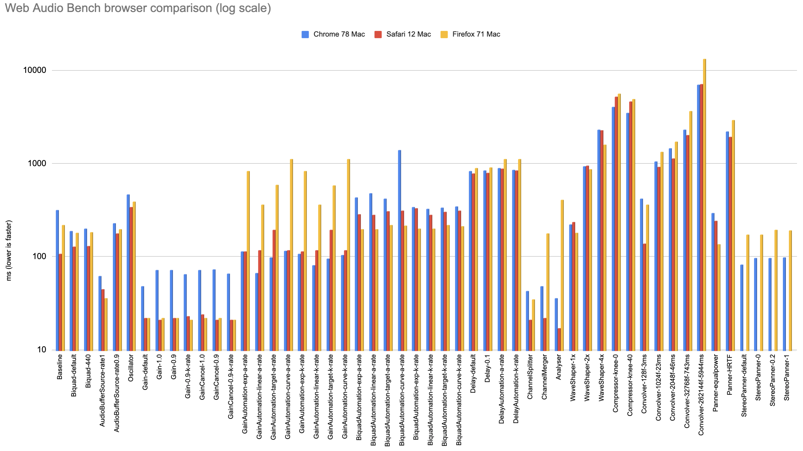

# Web Audio Bench Example

These are example runs from a MacBook Pro 2017 (3,1 GHz Intel Core i7).

| TEST                           | Chrome 78 Mac | Safari 12 Mac | Firefox 71 Mac |
|--------------------------------|---------------|---------------|----------------|
| Baseline                       | 317           | 107           | 220            |
| Biquad-default                 | 190           | 129           | 182            |
| Biquad-440                     | 201           | 130           | 184            |
| AudioBufferSource-rate1        | 62            | 45            | 36             |
| AudioBufferSource-rate0.9      | 228           | 177           | 198            |
| Oscillator                     | 467           | 344           | 390            |
| Gain-default                   | 48            | 22            | 22             |
| Gain-1.0                       | 72            | 21            | 22             |
| Gain-0.9                       | 72            | 22            | 22             |
| Gain-0.9-k-rate                | 65            | 23            | 21             |
| GainCancel-1.0                 | 72            | 24            | 22             |
| GainCancel-0.9                 | 73            | 21            | 22             |
| GainCancel-0.9-k-rate          | 66            | 21            | 21             |
| GainAutomation-exp-a-rate      | 114           | 114           | 832            |
| GainAutomation-linear-a-rate   | 67            | 118           | 364            |
| GainAutomation-target-a-rate   | 99            | 195           | 591            |
| GainAutomation-curve-a-rate    | 116           | 118           | 1120           |
| GainAutomation-exp-k-rate      | 107           | 114           | 834            |
| GainAutomation-linear-k-rate   | 81            | 118           | 363            |
| GainAutomation-target-k-rate   | 95            | 195           | 580            |
| GainAutomation-curve-k-rate    | 105           | 117           | 1121           |
| BiquadAutomation-exp-a-rate    | 431           | 287           | 199            |
| BiquadAutomation-linear-a-rate | 483           | 283           | 197            |
| BiquadAutomation-target-a-rate | 422           | 310           | 218            |
| BiquadAutomation-curve-a-rate  | 1402          | 311           | 216            |
| BiquadAutomation-exp-k-rate    | 340           | 331           | 201            |
| BiquadAutomation-linear-k-rate | 328           | 284           | 201            |
| BiquadAutomation-target-k-rate | 339           | 304           | 219            |
| BiquadAutomation-curve-k-rate  | 347           | 311           | 214            |
| Delay-default                  | 828           | 787           | 903            |
| Delay-0.1                      | 840           | 802           | 913            |
| DelayAutomation-a-rate         | 898           | 888           | 1125           |
| DelayAutomation-k-rate         | 853           | 847           | 1127           |
| ChannelSplitter                | 43            | 21            | 35             |
| ChannelMerger                  | 48            | 22            | 178            |
| Analyser                       | 36            | 17            | 408            |
| WaveShaper-1x                  | 221           | 236           | 181            |
| WaveShaper-2x                  | 942           | 952           | 877            |
| WaveShaper-4x                  | 2310          | 2267          | 1590           |
| Compressor-knee-0              | 4090          | 5230          | 5603           |
| Compressor-knee-40             | 3503          | 4640          | 4960           |
| Convolver-128f-3ms             | 424           | 138           | 361            |
| Convolver-1024f-23ms           | 1050          | 930           | 1343           |
| Convolver-2048f-46ms           | 1460          | 1133          | 1733           |
| Convolver-32768f-743ms         | 2322          | 2024          | 3688           |
| Convolver-262144f-5944ms       | 7000          | 7127          | 13320          |
| Panner-equalpower              | 297           | 244           | 137            |
| Panner-HRTF                    | 2213          | 1947          | 2947           |
| StereoPanner-default           | 83            | -             | 174            |
| StereoPanner-0                 | 97            | -             | 174            |
| StereoPanner-0.2               | 97            | -             | 195            |
| StereoPanner-1                 | 98            | -             | 192            |
